<div align="center">


<h3>AI inference beyond the VRAM wall</h3>

<h4>An inference operating system for large models</h4>

<p>
<sub>
Memory residency, device-first token state, heterogeneous CPU/GPU execution, and token-level observability, all built into the runtime itself rather than bolted on afterward.
</sub>
</p>

<p>


</p>

</div>

---

## Table of contents

- [Overview](#overview)
  - [What NERVA is](#what-nerva-is)
  - [The thesis](#the-thesis)
  - [What the measurements say](#what-the-measurements-say)
- [The architecture](#the-architecture)
  - [Why inference needs a new machine](#why-inference-needs-a-new-machine)
  - [What changes](#what-changes)
  - [ResidentBlocks](#residentblocks)
  - [Memory residency](#memory-residency)
  - [CPU and GPU roles](#cpu-and-gpu-roles)
  - [Device-first decoding](#device-first-decoding)
  - [KV cache as virtual memory](#kv-cache-as-virtual-memory)
  - [Static arenas and synchronization](#static-arenas-and-synchronization)
  - [Token ledgers](#token-ledgers)
- [Hardware and the road ahead](#hardware-and-the-road-ahead)
  - [Hardware model](#hardware-model)
  - [Coherent shared memory](#coherent-shared-memory)
  - [Future transport and distributed inference](#future-transport-and-distributed-inference)
    - [Move activations, not weights](#move-activations-not-weights)
    - [The VRAM-to-NIC problem](#the-vram-to-nic-problem)
    - [Choosing a transport path](#choosing-a-transport-path)
    - [Topology-aware egress](#topology-aware-egress)
    - [Backends, fabrics, and the engineering boundary](#backends-fabrics-and-the-engineering-boundary)
- [Positioning](#positioning)
  - [Relationship to vLLM and rvLLM](#relationship-to-vllm-and-rvllm)
  - [What NERVA is not](#what-nerva-is-not)
- [Status and direction](#status-and-direction)
  - [Current stage](#current-stage)
  - [Long-term goal](#long-term-goal)
- [Implementation and running it](#implementation-and-running-it)
  - [Current implementation](#current-implementation)
  - [Requirements](#requirements)
  - [Running the checks](#running-the-checks)

---

## Overview

### What NERVA is

NERVA means **Neural Execution & Residency Virtual Architecture**. It is an inference operating system for AI models, a Rust-first runtime with a CUDA-first device backend, built to rebuild LLM inference around memory residency rather than treating the GPU as one monolithic place where the whole model has to fit.

The Transformer math stays exact. NERVA does not start by changing the architecture, quantizing weights, pruning layers, dropping context, approximating attention, or swapping in a smaller target model. The model stays the model, and what changes is the execution machine around it.

So instead of treating inference as a sequence of framework calls that launch GPU kernels, NERVA treats it as a live scheduling problem that spans memory tiers, compute devices, synchronization phases, and token-causality state. Weights, KV cache, activations, tokens, sampler state, temporary workspaces, and future transport buffers all become explicit runtime objects, and each one carries its own location, ownership, lifetime, and next-use semantics. The point is simple but deep, which is that **the model is not loaded, the model is scheduled.**

### The thesis

Current inference engines usually start from a GPU-first assumption. They put the weights in VRAM, put the KV cache in VRAM, let the CPU feed the GPU, and make the CPU observe every token before the next step can proceed. That works when the model fits comfortably, the KV cache fits comfortably, batching hides overhead, and the workload is shaped for the hardware. It breaks down the moment the model is larger than VRAM, the context is long, the batch is small, the hardware is old, memory movement is hidden behind framework abstractions, or token latency matters more than aggregate throughput.

NERVA starts from a different assumption. The runtime should know where every meaningful block of data lives, who owns it, when it is needed next, whether it is hot or cold, whether it is cheaper to move it or compute beside it, and whether a synchronization is truly required for correctness. From there, inference gets scheduled around the critical path rather than blindly executed as a GPU command loop.

### What the measurements say

The redesign is anchored in measurement rather than intuition. On an RTX 5090 with 32 GB of VRAM running Qwen3-0.6B, once the model is loaded and warm, answer latency is dominated by the decode loop, the repeated single-token forward passes, and not by prefill, model loading, detokenization, or sampling. For a single prompt of 128 input tokens and 64 output tokens, the first token lands in about 6.61 ms while the full 64-token answer takes about 108.27 ms, so the 63 decode steps after the first account for roughly 94 percent of the answer latency.

| Workload, batch / input / output | Average latency |
|---|---:|
| 1 / 128 / 1, first token | 6.61 ms |
| 1 / 128 / 64, full answer | 108.27 ms |
| 8 / 128 / 1 | 19.00 ms |
| 8 / 128 / 64 | 151.80 ms |

Profiling a warm single-prompt decode shows the cost concentrating in dense linear algebra, with attention second and KV-cache writes, sampling, and host-device copies far behind. The chart below reproduces the profiler's own kernel buckets for that run, so it reflects relative kernel cost rather than a strict partition of wall time.

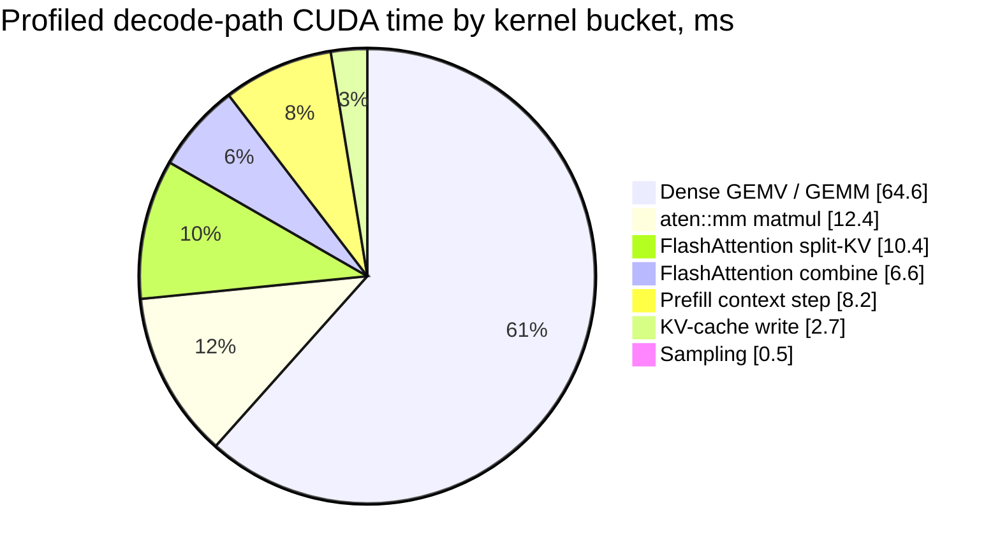

That is the whole reason NERVA puts decode, residency, and the critical path at the center. The wall to attack is per-token dense GEMV and GEMM, attention overhead, and per-step launch and synchronization cost at batch one, not PCIe bandwidth, model loading, or detokenization, which the same measurements rank as minor for this workload.

---

## The architecture

At the top level, NERVA replaces the GPU-centric command loop with an inference virtual machine, where a CPU control plane drives policy and scheduling, a memory operating system owns where every block lives, a GPU hot plane executes a prebuilt decode transaction, and a transport layer moves named block versions between domains. The device token ring is what closes the decode loop, and the host observes it asynchronously rather than gating every step.

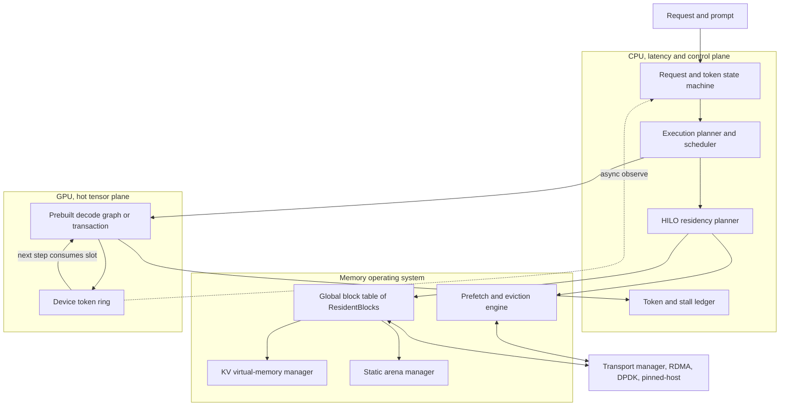

### Why inference needs a new machine

LLM inference is not one workload. It contains dense matrix math, attention over a growing KV cache, token sampling, request scheduling, memory allocation, device synchronization, CPU-visible output, host-to-device transfer, cache management, and sometimes disk or network staging. Treating all of that as "GPU work" hides the actual problem.

A GPU is excellent at hot, parallel, throughput-heavy tensor work, and a CPU is excellent at branchy, cache-resident, latency-sensitive control. DRAM is not just an emergency fallback, VRAM is not the model, disk is not token-time memory, and PCIe and network links are transfer fabrics rather than magic shared memory. So the real performance question is not whether a device is fast. It is whether the right data is in the right place at the right time, with the right owner, without forcing the rest of the pipeline to wait, and NERVA is built to make that question explicit.

### What changes

NERVA shifts the center of gravity of inference away from "load the model into the device" and toward "decide residency, ownership, movement, compute placement, synchronization, and observability before and during execution."

| Traditional inference | NERVA inference |
|---|---|
| The model is loaded into VRAM if possible. | The model is split into scheduled resident blocks. |
| CPU feeds GPU and waits for tokens. | CPU controls policy, memory, and metadata while GPU owns hot execution. |
| VRAM is treated as the model container. | VRAM is a managed hot cache. |
| DRAM is fallback or offload. | DRAM is a warm tier and a possible CPU-compute tier. |
| KV cache is a tensor allocation. | KV cache is virtual memory. |
| Decode is CPU-mediated token by token. | Decode is a device-resident transaction with asynchronous host observation. |
| Runtime overhead is discovered after profiling. | Token ledgers are part of the runtime contract. |
| Fallbacks may be implicit. | Fallbacks must be explicit and measurable. |

### ResidentBlocks

The core NERVA object is the **ResidentBlock**, which is any meaningful unit of data whose location and execution relationship matter. ResidentBlocks cover weights, weight tiles, KV pages, activations, logits, device tokens, host-visible tokens, sampler state, metadata, workspaces, staging buffers, and future transport buffers. Each one is tracked with enough information to answer practical execution questions, including what it is, how large it is, where it lives, who owns it, whether it is hot or cold, when it is needed next, whether it can be evicted, whether it can be prefetched, whether the CPU should compute against it directly, and whether the GPU should own the next phase.

This is the conceptual difference between NERVA and a normal tensor runtime. A tensor says "here are values," whereas a ResidentBlock says "here are values, here is where they live, here is who owns them, here is when they matter, and here is the cost of moving or computing against them." That richer object is the foundation of everything else.

Every block moves through an explicit residency state machine, and no executor is allowed to consume a block until its required replica is `Ready` and its version satisfies the execution dependency, which is what keeps a moved or evicted block from being read before its transfer finishes.

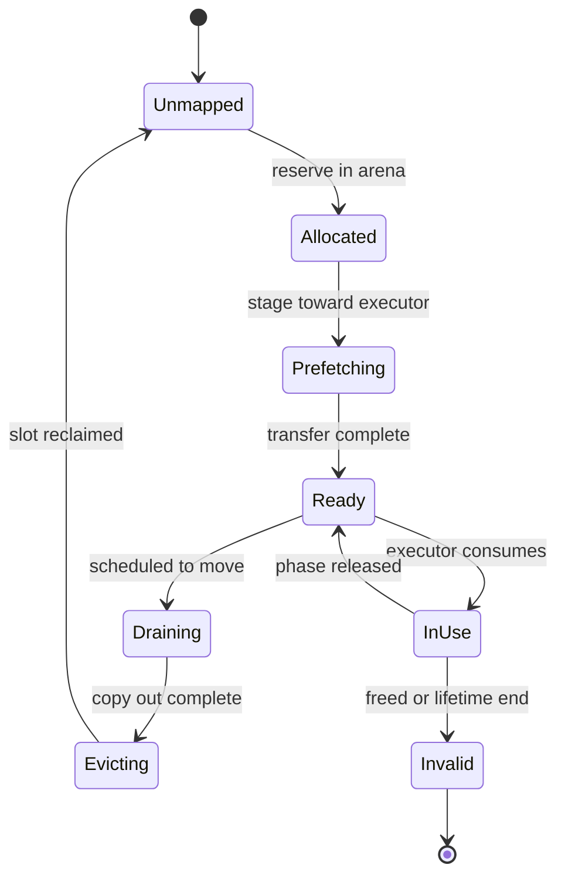

### Memory residency

NERVA treats memory as a hierarchy of roles rather than a binary capacity wall.

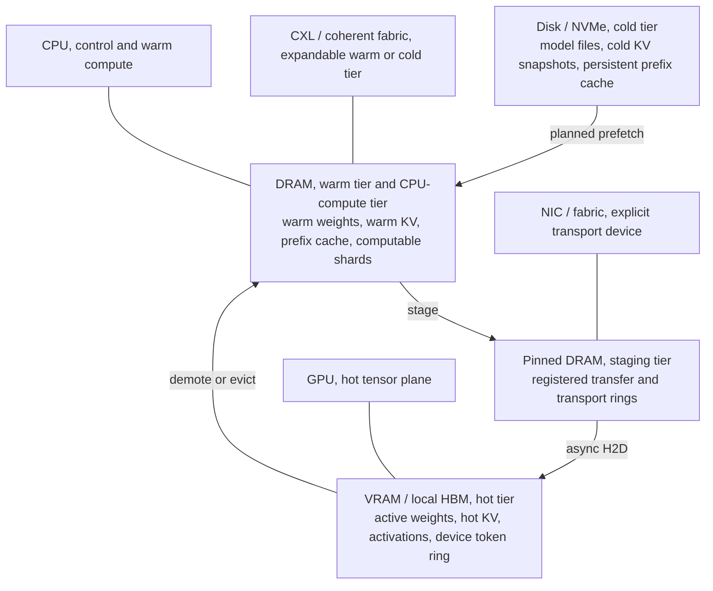

**VRAM** is the hot tier, and it should hold active weights, hot KV pages, current activations, graph workspaces, sampler state, prefetch slots, and the device token ring. It should not fill up with cold KV, duplicated prefixes, dead temporaries, or layout-conversion garbage.

**Pinned DRAM** is an explicit staging tier, allocated deliberately and reused rather than churned. It exists for controlled host-to-device movement, future RDMA fallback buffers, DPDK packet buffers, mapped host output, and overlap-friendly transfer paths.

**DRAM** is the warm tier, and it holds model backing data, warm weights, warm KV, metadata, prefix cache, scheduler state, CPU-computable shards, and prefetch targets. DRAM is not just slow VRAM, and in some cases it is better to compute against DRAM-resident data on the CPU than to move a huge block to the GPU.

**Disk or NVMe** is the cold tier, storing model files, cold weights, cold KV snapshots, persistent prefix and session cache, and pre-transformed layouts. Disk must never surprise the decode critical path, so if it is involved at all it enters through planned prefetch and cold staging.

**CXL or coherent shared memory** is a future expansion tier, and NERVA is designed so it can eventually target coherent memory fabrics without being rewritten around a CUDA-only, discrete-memory assumption. Across all of these tiers the runtime's job is to keep the critical path resident, not to keep everything resident.

### CPU and GPU roles

NERVA does not treat the CPU as a weak GPU, and it does not treat the GPU as a fast CPU.

The CPU is the latency control plane. It owns request state, scheduler state, stop policy, complex sampling policy, grammar and tool constraints, residency decisions, KV metadata, prefix metadata, weight-block metadata, disk IO planning, pinned-memory management, telemetry, token ledgers, and warm-compute work whenever that is cheaper than moving data. The GPU is the hot throughput plane. It owns resident GEMV and GEMM, prefill dense compute, hot decode projections, hot MLP blocks, attention over hot KV, device-side sampling fast paths, device token state, fused kernels, and persistent decode graph execution.

The deciding policy is compute-near-data versus move-data-to-compute. For batch-one decode, many operations look like a huge weight matrix applied to a tiny current activation, and if that weight block already lives in DRAM then copying the whole thing to the GPU may cost more than letting the CPU compute a partial result and merge the smaller output. NERVA is designed to measure and decide that explicitly, which makes CPU computation a planned mode rather than a desperate fallback.

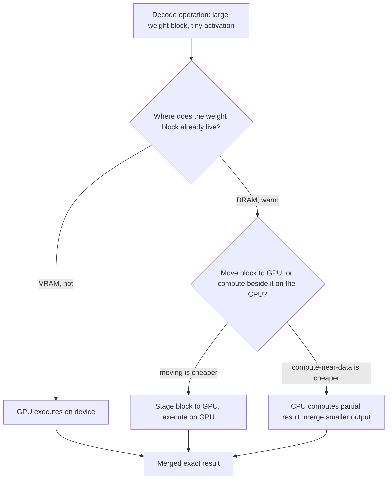

### Device-first decoding

Decode is the heart of the runtime. Traditional decode often forces a CPU-visible boundary on every token, so the GPU computes, sampling happens, a token is copied or exposed to the host, the CPU updates state, and only then does the next step proceed.

NERVA separates device token state from host token state. The device token state is what the GPU needs to continue generation, while the host token state is what the server, user, logger, stop policy, or streaming interface observes. Those two are related, but they should not always share the same synchronization point. In the NERVA model the GPU writes the sampled token into a device token ring, the next decode transaction consumes that device token directly, and the CPU observes the token asynchronously unless a correctness policy demands a hard synchronization.

This is not a license to ignore correctness. It is a way to classify correctness boundaries precisely, separating hard syncs, soft host-visibility syncs, debug-only syncs, and policy syncs required by complex stop strings, grammar constraints, or tool-call boundaries. The result is a decode loop designed as a device-resident transaction rather than a CPU-mediated token loop.

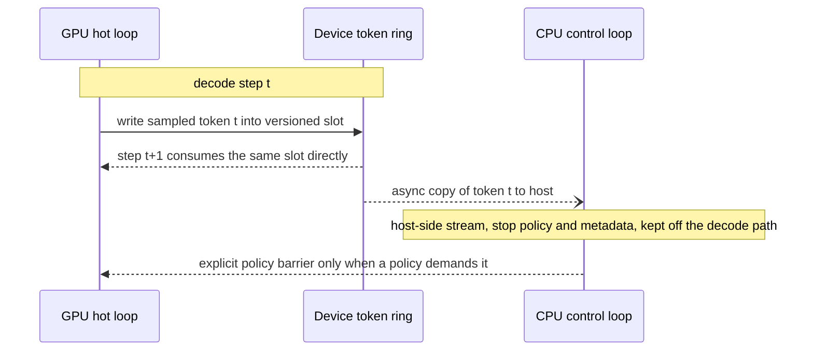

### KV cache as virtual memory

KV cache is not just a tensor, it is virtual memory. Each KV page carries a layer, a head or group, a token range, a size, a dtype, a location, a hotness, an owner, reuse information, and predicted next-use behavior. With that, the runtime can keep recent hot KV in VRAM, move warm KV to DRAM, retain cold KV outside the hot set, and eventually compute attention across multiple tiers at once.

The long-term design supports exact blockwise attention, where hot KV blocks run on the GPU, warm KV blocks may run on the CPU when that is cheaper than staging them, and partial attention results merge through the same online-softmax logic used by IO-aware attention algorithms. The constraint that matters here is exactness, because this tiered KV design never drops context, approximates attention, quantizes KV, or changes model semantics. It only changes where KV lives and where partial work executes.

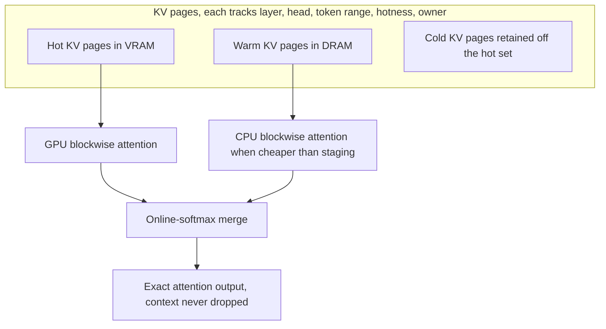

### Static arenas and synchronization

NERVA allocates before the hot path, not during it. The runtime preallocates CPU arenas, pinned DRAM arenas, GPU arenas, KV page pools, sampler buffers, graph buffers, telemetry buffers, and staging regions before decode begins. Once decode is running it does not allocate, free, map, unmap, pin, unpin, register memory, or create hidden page faults, and any allocation that does happen inside a supposedly hot phase counts as a runtime bug.

Synchronization gets the same treatment, because every sync has to justify itself. The runtime distinguishes hard correctness syncs, soft host-observation syncs, debug syncs, and policy syncs, and any sync that exists only because the framework structure forced it should be removed, overlapped, or redesigned. NERVA never hides these costs, since they are measured by the token ledger.

### Token ledgers

NERVA does not accept "tokens per second" as a sufficient explanation, so every generated token produces a ledger. A token ledger records wall latency, GPU active time, GPU idle gaps, CPU active time, CPU blocked time, graph launches, kernel count, runtime API calls, synchronization count, host-to-device bytes, device-to-host bytes, device-to-device bytes, memset bytes, allocator calls, page faults, scheduler time, and token-ring time, and it will eventually break out attention, MLP, norm, KV-write, sampling, and logits timings as well.

The ledger is not an external profiler artifact, it is part of the runtime contract, which is why NERVA can always answer the one question that profiling-by-mythology never quite does, namely why this token took this long.

The per-token record groups its fields by where the time and traffic actually go, so a slow token can be attributed to a specific plane rather than to a vague "GPU is busy."

```text
per token:
    token_id, total_latency_us
    CPU:     scheduler_us, sampling_us, blocked_us, page_faults, malloc_calls
    GPU:     active_us, idle_us, kernel_launches, sync_count, hbm_read_mb, hbm_write_mb
    PCIe:    h2d_bytes, d2h_bytes, visible_us
    DRAM:    read_mb, write_mb
    KV:      vram_pages, dram_pages, moved_pages
    Runtime: prefetched_blocks, evicted_blocks, graph_replays
```

The ledger exists to enforce four non-negotiable runtime rules, that every byte must justify its trip, every kernel launch must justify its existence, every synchronization must justify its stall, and every tensor must have a residency reason. Because CPU blocked time and GPU idle time are recorded separately, a CPU waiting on an event while the GPU does useful work is never miscounted as the GPU sitting idle.

---

## Hardware and the road ahead

### Hardware model

NERVA starts on Linux with one NVIDIA GPU and a CUDA backend, and that is an implementation starting point rather than a philosophical limit. The runtime is designed around backend capabilities, so CUDA-specific raw types stay inside the CUDA backend and core runtime structures avoid hardcoding NVIDIA-only assumptions, which leaves room for future HIP and ROCm support under the same backend contract.

CUDA comes first only because it is the immediate development environment, and the architecture has to allow HIP later by treating both as implementations of one broader device model built from device memory, pinned host memory, streams, events, graph-like execution where available, kernel launch, and device-visible state. In short, NERVA is CUDA-first, not CUDA-only.

### Coherent shared memory

The long-term hardware target is stronger than today's discrete CPU-plus-GPU machine. NERVA is designed for heterogeneous coherent shared-memory systems with a unified virtual address map, shared physical HBM or LPDDR, a coherent fabric or NoC, CPU cores for branchy latency work, GPU SMs or CUs for tensor throughput, hardware queues, and phase-based synchronization. On such machines the CPU and GPU may address the same physical memory, but that capability should not be abused, because random CPU-GPU ping-pong over the same cache lines can destroy performance.

NERVA answers this with phase-owned coherence, where a block can be CPU-owned, GPU-owned, shared read-only, or in a handoff phase, so coherence serves zero-copy visibility and clean ownership transfer rather than uncontrolled fine-grained sharing. On today's discrete systems NERVA emulates this model with explicit residency, staging, prefetch, and ownership tracking, and on future coherent machines the same model maps more directly onto the hardware.

The runtime discovers which kind of memory fabric it is running on at startup rather than guessing from the product name, and it treats four cases explicitly. `DiscreteExplicit` is today's separate CPU DRAM and GPU VRAM with explicit transfers, and it is the first target. `UnifiedVirtualManaged` shares a virtual address model but pages may fault or migrate, so it is used only after characterization and never with reactive migration on the decode path. `CoherentSharedPhysical` shares physical memory and hardware coherence, which turns block location into a locality preference and ownership state rather than a visibility boundary. `CxlCoherentFabric` extends capacity and coherence across a CXL-class fabric, treated as another memory domain with its own measured latency and bandwidth rather than as more local HBM.

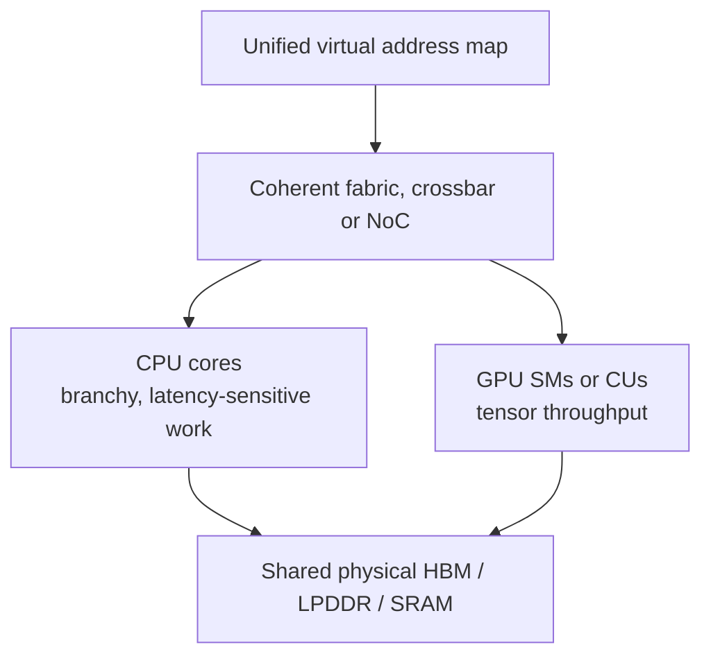

On such a machine the same block changes owner over time rather than being copied, and the runtime tracks that ownership as an explicit phase so a writer and a reader never collide on the same memory.

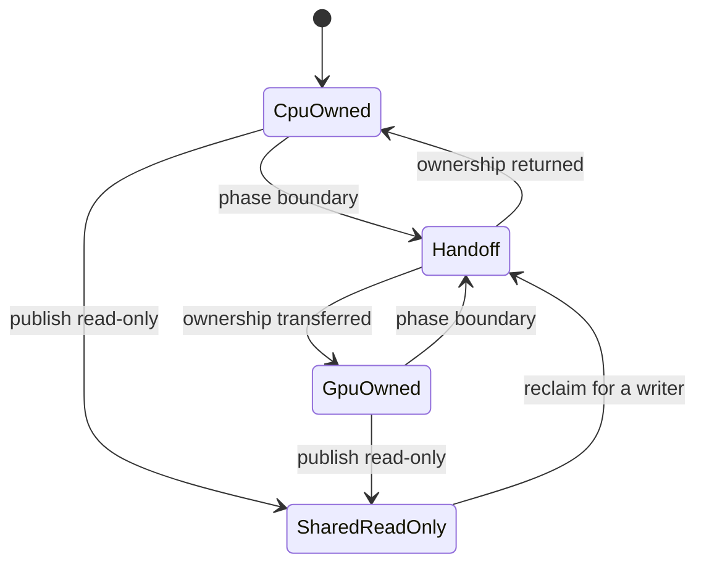

### Future transport and distributed inference

Networking, multi-host scheduling, RDMA, and DPDK are deliberately out of scope for the current single-GPU runtime, and they stay future work until the single-GPU critical path is fully understood and measured. The architecture is nonetheless built so a future NERVA can grow into a multi-host inference system without a rewrite, and this section records that design.

#### Move activations, not weights

The distributed rule is simple, which is to move activations, not weights. If a system owns a range of model layers then its weights and KV stay local, and the next system only needs the boundary activation, which makes inference across several machines possible without pretending every GPU belongs to one giant memory pool.

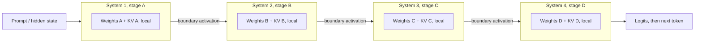

This pattern solves capacity rather than active-weight bandwidth, since a dense exact model still has to touch its active weights on each pass, and single-request decode stays sequential across stages, so pipeline utilization improves with multiple requests or chunked prefill rather than making serial token latency free.

#### The VRAM-to-NIC problem

Moving activations instead of weights is correct, but it hides a detail that decides whether the whole scheme is fast, which is where the activation actually lives at the moment it has to be sent. If the stage output sits in GPU VRAM and the NIC cannot read GPU memory directly, the path becomes VRAM, then pinned host DRAM, then NIC, then network, then remote DRAM, then remote VRAM, which crosses PCIe twice, touches DRAM, needs staging buffers, and adds synchronization. The direct path of VRAM, then NIC, then remote VRAM avoids the host bounce entirely.

The sizes explain why this is still workable even on the slow path. A decode boundary activation is tiny, since a hidden size of 16,384 at two bytes per element is about 32 KB per token, or roughly 96 KB across three system boundaries, while a prefill boundary is large, on the order of 8,192 by 16,384 by two bytes, about 256 MB, which is why prefill needs chunking and overlap. A ConnectX-6-class NIC runs around 200 Gb/s, roughly 25 GB/s raw, so for small decode activations the network serialization cost is negligible next to model weights, and the real killer is synchronization rather than raw bytes.

```mermaid
flowchart TB
    subgraph BEST["Best case, GPU-direct RDMA or PeerDirect verified"]
        direction LR
        GV1["Source GPU VRAM"] --> N1["NIC reads VRAM directly"] --> NET1["InfiniBand or RoCE"] --> N2["Remote NIC writes VRAM"] --> GV2["Remote GPU VRAM"]
    end
    subgraph FB["Fallback, NIC cannot read VRAM"]
        direction LR
        GV3["Source GPU VRAM"] --> P1["async D2H into pinned ring"] --> N3["NIC RDMA send"] --> NET2["network"] --> P2["remote pinned ring"] --> H1["async H2D"] --> GV4["Remote GPU VRAM"]
    end
```

#### Choosing a transport path

The runtime detects the best available path at startup, records the decision in the ledger, and degrades deterministically rather than silently picking an arbitrary slow route.

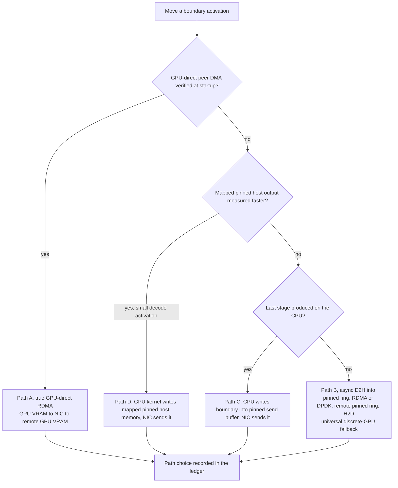

Path A is the direct GPU-to-NIC-to-GPU route used when peer DMA, topology, and ordering are verified. Path B is the optimized pinned-host bounce, the universal fallback for discrete GPUs, which still uses host DRAM but avoids any CPU memcpy by going through pre-registered pinned rings. Path C is used when the final stage work is already CPU-resident, so the boundary is written straight into a pinned send buffer and never makes a pointless trip to the GPU and back. Path D has the GPU's final kernel write the boundary directly into mapped pinned host memory, which removes a separate D2H copy and can win for small decode activations even though it still crosses PCIe. Decode and prefill then use different modes, where decode pre-posts receives onto fixed registered rings with no per-token handshake or allocation, and prefill streams chunks and overlaps stage compute with network transfer because its boundary tensors are large.

#### Topology-aware egress

It is not enough to partition layers, because the runtime also has to partition egress responsibility. GPU-direct RDMA performs best when the GPU and the NIC sit under the same PCIe root complex, so a system should produce its stage-boundary tensor on the GPU nearest the NIC rather than wherever the computation happens to land. The rule is to ask not which GPU is fastest but which GPU is closest to where the data has to go next, which usually means assigning the final local layer of a stage to the NIC-near GPU and letting it own the egress packing.

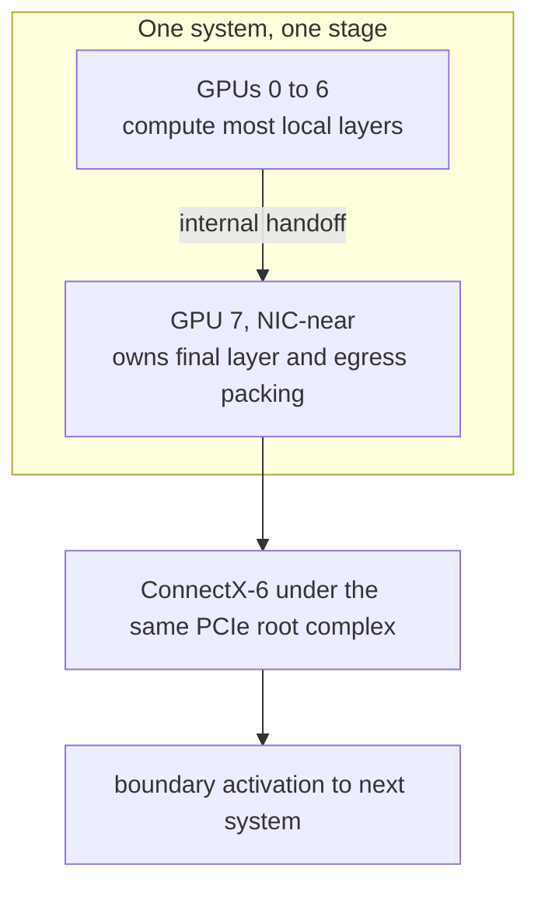

#### Backends, fabrics, and the engineering boundary

The transport abstraction is meant to sit over several backends rather than one vendor path. On NVIDIA the direct route is GPUDirect RDMA through either Linux DMA-BUF or the legacy `nvidia-peermem` module, on AMD it is ROCm PeerDirect, and both ride UCX or libibverbs as the portable layer, with NCCL and NVSHMEM as later options for collectives and GPU-initiated communication, GPUDirect Storage reserved for cold model staging rather than token-time transfer, DPDK UDP as a future custom packet data plane, and TCP confined to control, discovery, and debugging because it is not a production tensor data plane. The fabric itself can be InfiniBand, which is the lower-friction HPC path with the best latency, or RoCE over Ethernet, which is cheaper and more flexible but needs careful lossless-Ethernet and congestion tuning.

The hardware caveat is real and is treated as such. GPUDirect RDMA is documented for data-center and workstation-class GPUs, so it must not be assumed on consumer GeForce parts like the RTX 2080 Ti, which means the runtime tests the direct path at startup and uses the pinned-host route when it is unavailable rather than designing around a capability that may silently fall back. This sets a clear engineering boundary, that NERVA builds the inference system, the residency and execution planner, the stage pipeline, the transport abstraction, and a custom protocol, and it integrates documented vendor peer-memory paths where they exist, but it does not try to fabricate unsupported GPU peer-memory mappings or hand-replace a vendor peer-memory driver, because the GPU driver owns the memory manager and reverse-engineering its page tables would be fragile and unmaintainable. The design therefore never requires proprietary enterprise memory pooling, only an honest transport abstraction with multiple backends, topology awareness, pre-registered buffers, and correct asynchronous ownership.

---

## Positioning

### Relationship to vLLM and rvLLM

NERVA learns from both vLLM and rvLLM without being a fork of either. vLLM is the production ecosystem reference, strong on model compatibility, serving infrastructure, paged KV ideas, attention backend structure, scheduler behavior, benchmark discipline, and real-world deployment pressure, and NERVA studies it closely without inheriting a Python or PyTorch-centered hot path.

rvLLM is the Rust and CUDA architecture reference, strong on Rust-owned execution, explicit kernels, CUDA graph execution, and engine ownership with no Python in the serving path, and NERVA studies it just as closely without blindly inheriting model-family-specific, FP8-first, H100-only, or narrow serving assumptions. What NERVA builds instead is a new runtime organized around ResidentBlock scheduling and memory residency.

### What NERVA is not

NERVA is not a quantizer, a pruner, a distillation pipeline, or an attention approximation. It does not shrink the model, drop context, or trade accuracy for speed, because the Transformer math stays exact.

NERVA is also not a Python or PyTorch wrapper, and it is not a thin scheduler bolted onto an existing engine, because the hot path is Rust-owned and the device backend is explicit rather than hidden behind a framework. Finally, at this stage NERVA is not a finished serving system, a multi-GPU engine, or a network transport, and those are designed-for futures rather than current claims, which the runtime is honest about.

---

## Status and direction

### Current stage

The current development stage is runtime foundation plus deterministic block, FP16/BF16 precision-block, single-model, vLLM-style token-identity parity, header-only safetensors validation, tiered-attention, warm-compute, kernel-contract, and residency probes. The first target is not a serving system; it is a runtime that proves it can initialize the device when one is visible, own memory, allocate static arenas, replay a synthetic decode graph, keep token state on device, emit token ledgers, avoid hot-path allocation, run exact reference and 16-bit Transformer block paths, inspect real model files without bulk payload reads, run one exact tiny greedy decode path, compare that token stream against a vLLM-style token artifact, execute exact blockwise attention across DRAM and VRAM tiers, choose CPU/GPU compute placement from visible candidate costs, validate kernel buffer contracts, and make KV residency decisions visible.

```bash
cargo run -p nerva-bench -- smoke
cargo run -p nerva-bench -- cuda-graph 1024 64 1
cargo run -p nerva-bench -- synthetic 1024 64
cargo run -p nerva-bench -- block
cargo run -p nerva-bench -- precision
cargo run -p nerva-bench -- model 8
cargo run -p nerva-bench -- vllm-parity path/to/vllm_tokens.json 8
cargo run -p nerva-bench -- attention
cargo run -p nerva-bench -- warm
cargo run -p nerva-bench -- contracts
cargo run -p nerva-bench -- kv
```

The `precision` probe runs the same block structure through explicit FP16 and BF16 encoded weights, inputs, outputs, and preallocated scratch, then checks bit-level parity against the reference output encoded to the same dtype. The `safetensors` probes validate single-file and sharded HF tensor metadata by reading bounded headers rather than scanning full payloads. The `model` probe is intentionally tiny: a deterministic f32 reference model with exact greedy token parity and ledger checks. The `vllm-parity` probe consumes a vLLM-style token JSON artifact and compares exact token identity, first mismatch, missing/extra token counts, output hashes, and hot-path allocation status against NERVA's deterministic token stream. The `attention` probe is also small, but it verifies exact online-softmax merging across warm DRAM and hot VRAM KV blocks. The `warm` probe compares exact CPU-resident, GPU-resident, GPU-staged, and hybrid dense matvec candidates, records the selected execution owner, and proves the staged path can lose to compute-near-data. The `contracts` probe validates the first decode-kernel contract shape: launch bounds, device-resident buffers, and no hot-path allocation permission. The `kv` probe exercises a small KV page pool with prefetch, demotion, eviction, copy attribution, and visible-stall ledger events. The next milestones are to connect these contracts to a larger real-model loader path, broader residency planning, CPU/GPU compute-near-data experiments, multi-GPU, and distributed execution.

### Long-term goal

The long-term goal is exact large-model inference that degrades gracefully beyond VRAM. NERVA should eventually support fully resident inference, VRAM-hot-cache inference, CPU/GPU hybrid inference, long-context tiered KV, models larger than VRAM, coherent shared-memory systems, AMD and HIP devices, RDMA transport, DPDK UDP transport, multi-GPU execution, distributed stage pipelines, and old hardware profiles. The aim is not to pretend that many devices are one giant GPU, but to coordinate many memory and compute domains as a single inference machine.

In that machine, weights stay where they are useful, KV stays local to the layers that own it, activations move only when needed, the CPU controls policy and computes near warm data when profitable, the GPU executes hot tensor math, and transports use direct paths when the hardware supports them and pinned fallbacks when it does not.

The final purpose of NERVA is to make AI inference less dependent on giant VRAM pools and vendor-blessed monolithic hardware assumptions. Training made models big, and inference systems decide who can actually run them, so NERVA is the attempt to rebuild that inference system from the ground up.

The build order reflects that single-GPU-first discipline, where each step has to produce clean, measured results before the next one is allowed to build on it, and networking only appears after the local runtime is trustworthy.

```mermaid
flowchart LR
    B1["Baseline<br/>profile a warm engine"] --> B2["Synthetic block<br/>and static arenas"]
    B2 --> B3["Placement benchmark<br/>move vs compute-near-data"]
    B3 --> B4["Persistent decode graph"]
    B4 --> B5["Tiered KV<br/>exact online-softmax merge"]
    B5 --> B6["Minimal real model<br/>then scale"]
    B6 -.future.-> B7["Same-node multi-GPU"]
    B7 -.future.-> B8["Distributed stage pipeline<br/>and transport layer"]
```

---

## Implementation and running it

### Current implementation

This repository is in the runtime foundation stage, so it is not a production model server yet. The current code exists to prove the first runtime contracts, and it is intentionally small because the goal is to lock those contracts down before a larger model path goes on top.

| Checkpoint | Current artifact |
|---|---|
| Device smoke | CUDA driver and runtime load, primary context setup, device allocation, pinned-host allocation, one kernel, and a JSON ledger summary. |
| Static arena | CPU, pinned-host, and GPU logical arenas are preallocated, and any hot-path arena allocation attempt is rejected and ledgered. |
| Synthetic transaction | A native CUDA graph captures a synthetic device-token step against preallocated device state/ring/pinned observation, and the Rust synthetic ledger counts graph replay separately from device activity, copies, and host-visibility waits. |
| Device token | 1,024 synthetic decode steps run on device-ring causality with zero stale, missing, extra, mismatched, or host-causality tokens. |
| Real block | One exact f32 Transformer block runs through a preallocated scratch path with zero hot-path allocations. |
| Precision block | One exact FP16 and BF16 Transformer block path uses encoded 16-bit weights, inputs, outputs, and preallocated scratch with bit-level reference parity. |
| Safetensors header loader | Single-file and sharded safetensors probes read bounded headers, validate tensor metadata against the HF manifest, and avoid bulk payload reads during metadata inspection. |
| Single model | One exact tiny f32 greedy decode path checks deterministic token parity and per-token ledgers. |
| vLLM token parity | A vLLM-style token artifact is compared against NERVA token IDs with exact mismatch, missing, extra, and hash accounting. |
| Tiered attention | Exact online-softmax blockwise attention merges warm DRAM and hot VRAM KV blocks without changing semantics. |
| Warm compute | Exact dense matvec candidates compare CPU-resident, GPU-resident, GPU-staged, and hybrid execution with selected-owner ledgering. |
| Kernel contracts | Decode-kernel contract descriptors validate launch bounds, device-resident buffers, and zero hot-path allocation permission. |
| Residency probe | KV page placement across DRAM and VRAM produces explicit prefetch, demotion, eviction, copy, stall, and residency-decision ledger entries. |

### Requirements

NERVA currently builds on Linux only, and the first host targets are Ubuntu on `x86_64` and `aarch64`.

The CUDA backend supports **CUDA 12.x and CUDA 13.x only.** Older CUDA stacks are not supported, and newer CUDA major versions should be treated as unsupported until the loader and smoke checks are updated to match. The CUDA loader is written to probe platform-specific driver and runtime library names, but the runtime crates stay gated to Linux while the M0 runtime contracts are being built.

CUDA architecture selection uses explicit overrides first, local GPU detection second, and compiler-supported default architectures last. Use `NERVA_CUDA_ARCHITECTURES`, `CUDAARCHS`, or `CMAKE_CUDA_ARCHITECTURES` for a list such as `75;86;89;120`; use `NERVA_CUDA_ARCH` or `CUDA_ARCH` for one target such as `sm_120` or `12.0`. `CUDA_HOME`, `CUDA_PATH`, and `CUDACXX` select the CUDA toolkit and compiler when the default `nvcc` is not the right one.

### Running the checks

```bash
cargo test --workspace
```

```bash
cargo run -p nerva-bench -- smoke
cargo run -p nerva-bench -- cuda-graph 1024 64 1
cargo run -p nerva-bench -- synthetic 1024 64
cargo run -p nerva-bench -- block
cargo run -p nerva-bench -- precision
cargo run -p nerva-bench -- model 8
cargo run -p nerva-bench -- vllm-parity path/to/vllm_tokens.json 8
cargo run -p nerva-bench -- attention
cargo run -p nerva-bench -- warm
cargo run -p nerva-bench -- contracts
cargo run -p nerva-bench -- kv
```

The benchmark commands emit single-line JSON summaries, and the acceptance fields that matter are `hot_path_allocations: 0`, exact token parity for the model probe, exact FP16/BF16 bit parity for the precision probe, bounded safetensors `header_bytes` and `payload_bytes`, exact vLLM-style token identity parity, exact dense-reference parity for the attention tests, zero synthetic token audit failures, the graph, device, copy, and host-wait event counts, warm-compute `execution_decisions`, contract `device_resident_buffers`, and the explicit KV residency transfer and stall ledger events.
